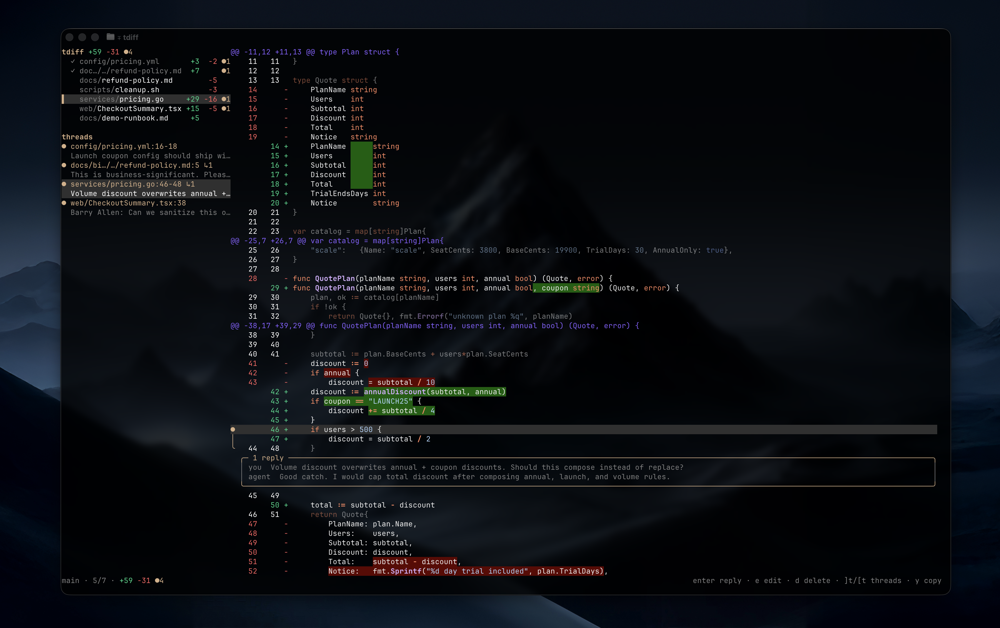
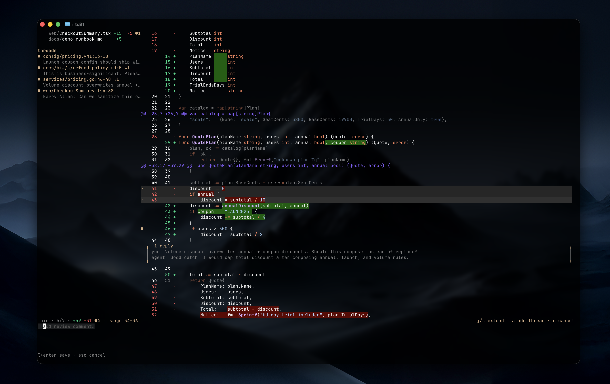
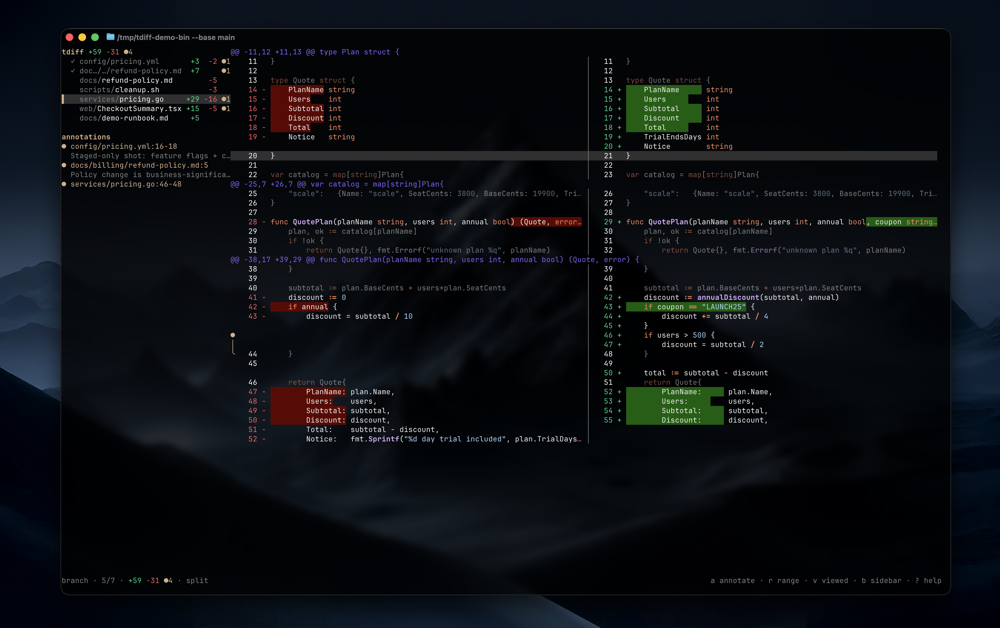
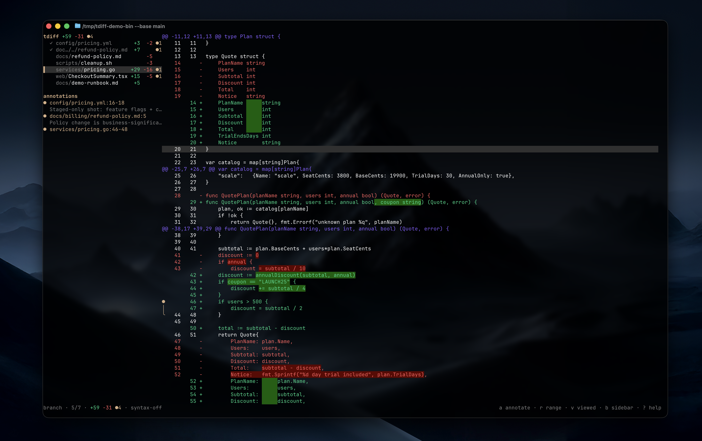

# tdiff `∓`

[](https://github.com/owenps/tdiff/actions/workflows/tests.yml)

Review changes like a PR, without leaving terminal. tdiff is a local review canvas where humans and agents talk on top of a diff.

Threads attach to changed lines/ranges, persist in the repo, and are available to agents as JSON/events.



## Screenshots

### Multi-line Threads

Use <kbd>r</kbd> to start a multi-line select then <kbd>a</kbd> to start a thread.



### Unified and Split View



### Automatic Syntax Highlighting

Toggle syntax on and off with <kbd>x</kbd>.



## Installation

```sh
go install github.com/owenps/tdiff@latest
tdiff
```

Default view shows branch changes plus staged/unstaged/untracked working tree changes.

For GitHub integration, install the `gh` CLI.

## Working with agents

Tell your agent:

```text
Use tdiff for review comments. Run `tdiff agent help`, then wait for my tdiff review events and respond in threads.
```

Agent loop:

```sh
tdiff agent inbox --json
tdiff review watch
tdiff thread reply T123 --actor agent --body "Fixed; added test"
```

`tdiff review watch` emits compact text events. Use `--json` for JSONL.

## CLI

```sh
tdiff --base main
tdiff --staged
tdiff --unstaged
tdiff --offline

tdiff agent help
tdiff agent inbox --json
tdiff agent inbox 5 --json

# agent/review API
tdiff review status --json
tdiff review context --json
tdiff review approve
tdiff review unapprove
tdiff review watch
# event history / JSONL if needed:
tdiff review events
tdiff review watch --json

tdiff thread list --json
tdiff thread show T123 --json
tdiff thread add --file internal/foo.go --line 42 --side new --body "Needs nil check"
tdiff thread reply T123 --actor agent --body "Fixed and added test"
tdiff thread resolve T123
tdiff thread reopen T123
# use --body - to read long thread text from stdin

```

## Data

tdiff stores review data locally in your repo:

```sh
.git/tdiff/review.json
.git/tdiff/events.jsonl
```

This includes review approval, threads, messages, viewed-file state, and GitHub PR metadata.

## Keybinds

- <kbd>?</kbd> show/hide keybind help modal
- <kbd>q</kbd> quit
- <kbd>j</kbd>/<kbd>k</kbd> move line
- <kbd>gg</kbd>/<kbd>G</kbd> jump top/bottom
- <kbd>]h</kbd>/<kbd>[h</kbd> next/previous hunk
- <kbd>]t</kbd>/<kbd>[t</kbd> next/previous thread
- <kbd>:line</kbd> jump to file line in current diff
- <kbd>n</kbd>/<kbd>p</kbd> move file
- <kbd>v</kbd> toggle viewed; marking viewed jumps to next unviewed file
- <kbd>A</kbd> approve/unapprove current review snapshot
- <kbd>u</kbd> hide/show viewed files
- <kbd>m</kbd> show files with threads only
- <kbd>y</kbd> copy selected thread
- <kbd>Y</kbd> copy all threads JSON
- <kbd>W</kbd> toggle whitespace handling/reload diff
- <kbd>R</kbd> refresh diff and sync GitHub PR threads
- <kbd>s</kbd> toggle split/unified placeholder
- <kbd>#</kbd> attach/change GitHub PR (disabled with `--offline`)
- <kbd>b</kbd> show/hide left sidebar
- <kbd>i</kbd> show/hide inline threads
- <kbd>x</kbd> toggle syntax highlighting
- <kbd>c</kbd> toggle context dimming
- <kbd>w</kbd> wrap cursor line
- <kbd>L</kbd> toggle line numbers
- <kbd>r</kbd> start/cancel line range
- <kbd>a</kbd> add/edit thread on selected line/range
- <kbd>enter</kbd> reply to selected thread
- <kbd>e</kbd> edit thread on selected line/range
- <kbd>d</kbd> delete thread on selected line/range
- <kbd>⌥</kbd>+<kbd>enter</kbd> save thread
- <kbd>esc</kbd> cancel thread

## Development

```sh
go run .
go test ./...
```
